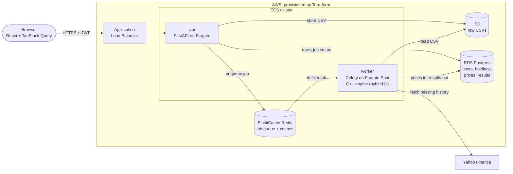

# Quantly

Portfolio analytics platform. Upload your holdings and get real risk and performance insights, not just "what's it worth."

## Overview

Quantly turns a CSV of your stock holdings into the analytics your brokerage screen doesn't give you: how risky your portfolio actually is, whether you're being paid for that risk, and whether you're genuinely diversified.

It is also a deliberate exercise in production system design. The API and the compute are separate services that scale independently, analysis runs asynchronously off a queue, the path-dependent risk math is written in C++ and benchmarked against NumPy, and the whole AWS stack is Terraform that gets stood up for a demo and torn down afterwards.

## Screenshots

The sample portfolio in [`example_csv/ex2.csv`](./example_csv/ex2.csv), analyzed against five years of real price history. ([Full page](./docs/screenshots/portfolio-detail.png).)


Every risk metric comes with what it means, not just the number:


The correlation heatmap answers "am I actually diversified?" at a glance:


## What it does

Beyond current value and gain/loss, Quantly surfaces risk and diversification insights. Each one is paired with a plain-English interpretation, not just a number:

| Metric | Question it answers |
|---|---|
| Volatility, max drawdown | How much could this realistically fall? |
| Sharpe / Sortino ratio | Am I being paid for the risk I'm taking? |
| Correlation matrix | Am I actually diversified, or do my holdings all move together? |
| Beta | How hard do I swing relative to the market? |
| Monte Carlo VaR | What does a bad month look like? |
| Allocation, concentration | How exposed am I to a handful of names? |

It is a diagnostic tool. It does not recommend trades or execute them.

## Architecture



### Request lifecycle

1. The user signs in with email and password, or with Google. Either way the API issues its own short-lived access JWT plus a rotating refresh token, so nothing downstream ever sees a Google token.
2. They upload a CSV. The API validates it, stores the raw file in S3, writes the holdings to Postgres, enqueues an analysis job on Redis, and returns `202 Accepted` straight away.
3. A Celery worker picks the job up, fetches whatever price history it is missing, computes the metrics, and writes the results back to Postgres.
4. The frontend polls the job status and renders the charts and insight cards once it completes.

### Design decisions

- **Two services, not one.** The api is small, stateless and latency-sensitive. The worker is CPU-bound and bursty. They are deployed, sized and scaled independently (0.25 vCPU on Fargate against 1 vCPU on Fargate Spot), so a heavy analysis never slows a request down.
- **Uploads never block on compute.** The queue decouples upload latency from analysis time. A failed job marks its portfolio `failed` with a reason instead of leaving it stuck.
- **Market data is demand-driven and shared.** History is fetched lazily the first time a ticker appears, then only the gap since the last stored day. It lives once in a shared `prices` table, so storage grows with the number of distinct tickers held, not with the number of users. Latest prices sit in Redis with a 15 minute TTL.
- **Refresh tokens rotate and can be revoked.** They are opaque, stored hashed, and replaced on every use. Reusing an old one revokes the whole family.
- **Least privilege by default.** Each service has its own IAM roles (the api can only write to the bucket, the worker can only read from it), only the load balancer is reachable from the internet, and secrets are injected from SSM at task start.
- **Designed for scale, operated at n=1.** The stack costs about $75 a month if left running, so it isn't. See [infra/README.md](./infra/README.md).

## Benchmarks

Every C++ kernel has a pure-Python and a NumPy-vectorized baseline, timed across problem sizes by [`benchmarks/run_benchmarks.py`](./benchmarks/run_benchmarks.py). Full tables are in [`benchmarks/results.md`](./benchmarks/results.md). The headline rows:

| Kernel | Size | Pure Python | NumPy | C++ | C++ vs NumPy |
|---|--:|--:|--:|--:|--:|
| Max drawdown | 5,040 daily returns | 786.7 us | 507.7 us | 12.1 us | **42.1x faster** |
| Monte Carlo VaR | 100,000 paths, 21 days | 769.46 ms | 56.45 ms | 63.21 ms | 0.9x (a tie) |
| Correlation matrix | 100 assets x 1,260 days | 915.34 ms | 1.70 ms | 5.52 ms | 0.3x (NumPy wins) |

The honest reading: C++ wins big on the path-dependent scan NumPy cannot vectorize, ties where the simulation vectorizes cleanly, and loses to multithreaded BLAS on matrix math. Against pure Python it is 12x to 180x faster everywhere. That is why only the path-dependent metrics are routed to the engine, and why the worker falls back to NumPy without losing much when the engine isn't installed.

Numbers are from one machine (Python 3.14.0, NumPy 2.3.4). The ratios are the point, not the absolute times.

## Tech stack

| Layer | Tools |
|---|---|
| Frontend | React 19, TypeScript, Vite, Tailwind CSS, TanStack Query, Lightweight Charts |
| API | FastAPI, SQLAlchemy, Alembic, PyJWT, argon2 |
| Worker | Celery, Redis, pandas, NumPy, yfinance |
| Engine | C++17, pybind11, scikit-build-core, Catch2 |
| Data | PostgreSQL, Redis, S3 |
| Infrastructure | Terraform, AWS (ECS Fargate, RDS, ElastiCache, ALB, ECR, S3, SSM, CloudWatch) |
| CI/CD | GitHub Actions, OIDC to AWS |

## Repo layout

```
backend/
  api/          FastAPI app: routers, schemas, auth, dependencies
  worker/       Celery app and the analysis task
  common/       shared by both: models, config, market data, analytics
  scripts/      demo seed script
  tests/        pytest suite
engine/         C++ sources, pybind11 bindings, Catch2 tests
benchmarks/     C++ vs NumPy vs pure Python
frontend/       React app
infra/          Terraform, see infra/README.md
example_csv/    sample brokerage exports to upload
```

## Getting started

Everything runs locally for free. You need Docker, Python 3.13+ and a current Node LTS.

```bash
# postgres, redis, minio (a local stand-in for s3) and the celery worker
docker compose up -d

# api
cd backend
python -m venv .venv
# Windows (PowerShell):   .venv\Scripts\Activate.ps1
# macOS / Linux:          source .venv/bin/activate
pip install -r requirements/dev.txt
alembic upgrade head
uvicorn api.main:app --reload      # http://localhost:8000, docs at /docs
```

In a second terminal:

```bash
cd frontend
npm install
cp .env.example .env
npm run dev                        # http://localhost:5173
```

Then either register and upload one of the files in [`example_csv/`](./example_csv), or create a ready-made demo account with an analyzed portfolio:

```bash
cd backend
python -m scripts.seed             # prints the demo login when it is done
```

The C++ engine is optional. Without it the worker uses the NumPy implementations. To build and install it into the current environment (needs a C++ compiler and CMake):

```bash
pip install ./engine
```

## Tests and CI

```bash
make lint     # ruff, isort, black
make test     # pytest
```

| Workflow | Runs on | Does |
|---|---|---|
| `lint`, `test` | every push and PR | ruff, isort, black, pytest |
| `engine` | every push and PR | builds the C++ engine, runs its Catch2 tests, then pytest with the engine installed so the Python/C++ parity tests run |
| `images` | PRs touching `backend/` | builds the api and worker images |
| `terraform plan` | PRs touching `infra/` | fmt, validate, and a plan posted as a PR comment |
| `deploy` | push to `main`, while enabled | pushes images to ECR, `terraform apply`, migrations, smoke test |

## Deployment

The AWS stack is described, with a full runbook, in [infra/README.md](./infra/README.md).

## Status

The full path works end to end: auth, upload, async analysis, the insight layer, and the frontend. The infrastructure and deploy pipeline are written and validated, and are stood up on demand rather than left running.

Known gaps:

- The worker container image does not bundle the C++ engine yet, so containers run the NumPy fallback. The engine is built and tested in CI and can be installed locally.
- Job status is polled. There is no WebSocket or SSE push.

## Motivation

Quantly is both a personal and technical project. The scale and richness of financial data allow for advanced analytics and meaningful performance insights that apply directly to my own portfolio. Building a tool that helps with real investing decisions makes it personally motivating and technically challenging. It's also a vehicle for going deep on production system design: async processing, infrastructure-as-code, benchmarked C++ performance work, and secure modern auth.
