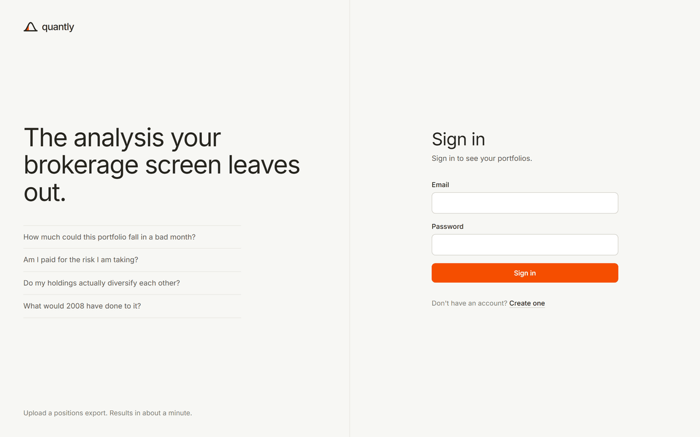
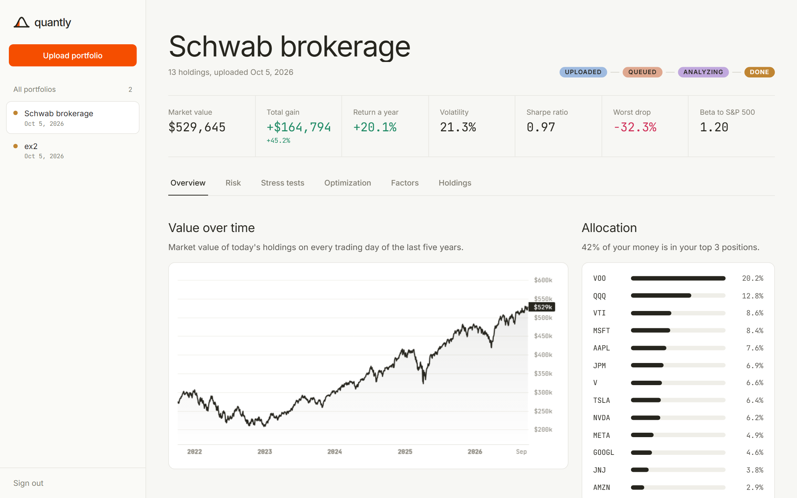
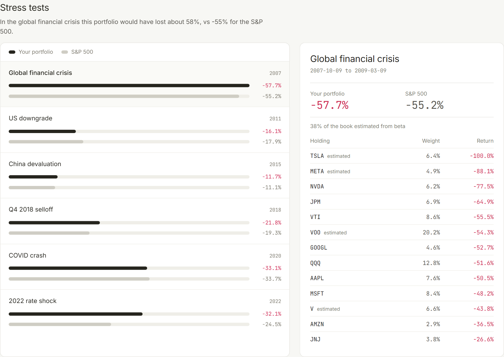
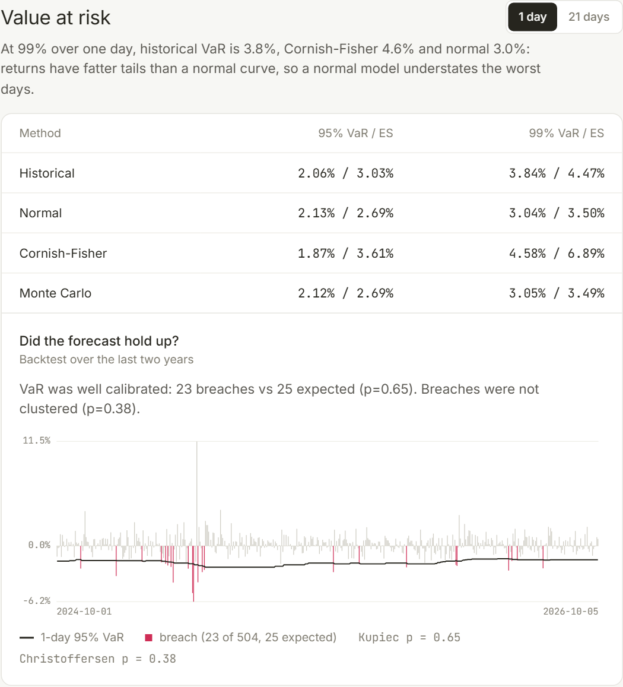
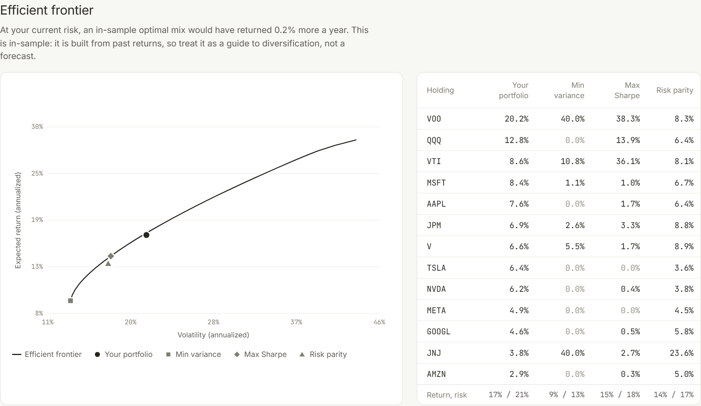
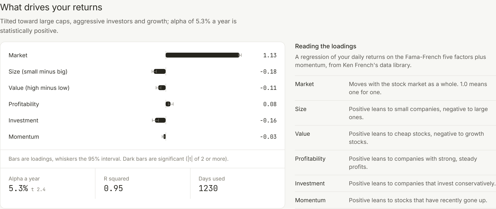

<picture>
  <source media="(prefers-color-scheme: dark)" srcset="./docs/logo-dark.svg">
  
</picture>

Upload a brokerage export and see how risky your portfolio really is: how far it could fall, whether the return is worth the risk, how it would have done in 2008, and what is actually driving it.



## Highlights

- **Async pipeline that survives crashes.** Uploads commit through a transactional outbox, a Celery worker analyzes them off a queue, and progress streams to the browser over server-sent events. A chaos run killed or restarted workers 6 times across 60 uploads: every portfolio finished, with no duplicate or partial results.
- **Real quant depth.** Stress tests replayed on prices back to 2007, four VaR methods with a Kupiec/Christoffersen backtest, a Ledoit-Wolf efficient frontier, and a Fama-French factor regression with Newey-West errors.
- **C++ where it pays.** A pybind11 engine runs the drawdown scan 43x faster than NumPy, and a multithreaded Monte Carlo VaR (Philox streams, bit-identical for any thread count) 5.7x faster. CI fails if a kernel regresses.
- **Measured, not claimed.** Load tested with k6: one API process on one CPU serves 20 uploads/s at p99 51 ms, and sheds load with a 503 past ~100 requests/s.
- **Tested from every side.** 348 backend tests including Hypothesis properties and cross-checks against empyrical, fuzzing and sanitizers on the C++ engine, and Playwright end-to-end tests against the real stack.

## Screenshots

Each portfolio opens on its key figures and an overview, with each deeper analysis on its own tab.



How the same portfolio would have done in past crises. Pick a scenario to see every holding's loss:



Four ways to estimate value at risk, and a backtest of whether the forecast held up:

<p align="center"></p>

Where the portfolio sits against the best mix of its own holdings, and what drives its returns:





## Results

| What | Result |
|---|---|
| Upload latency, one API process on 1 CPU, 20 uploads/s plus reads | p99 51 ms, 0 errors |
| Analysis throughput | 2.1 portfolios/s on one worker, 6.2/s on four |
| Chaos: 60 uploads, 6 worker kills or restarts | 60/60 complete, 0 duplicate or partial results |
| Drawdown kernel, C++ vs NumPy | 43x faster |
| Monte Carlo VaR, C++ vs NumPy | 5.7x faster on 22 threads |
| Tests | 348 backend, 58 frontend, Playwright end-to-end, fuzzing |

Running the real stack under load found bugs the unit tests could not, from a missing flush to a connection pool smaller than the API's thread pool. They are written up in [the design doc](./docs/design.md#what-running-it-under-load-found).

## Tech stack

| Layer | Tools |
|---|---|
| Frontend | React 19, TypeScript, Vite, Tailwind CSS, TanStack Query |
| Backend | FastAPI, SQLAlchemy, Celery, PostgreSQL, Redis, S3 |
| Quant | NumPy, pandas, SciPy, C++17 engine with pybind11 |
| Infrastructure | Terraform on AWS (ECS Fargate, RDS, ElastiCache, ALB), GitHub Actions |
| Observability | OpenTelemetry, Prometheus, Grafana, SLO burn-rate alerts |

## Run it

You need Docker, Python 3.13+ and Node.

```bash
docker compose up -d                 # postgres, redis, s3, the worker and beat

# terminal 1: the api on :8000
cd backend
pip install -r requirements/dev.txt
alembic upgrade head
uvicorn api.main:app

# terminal 2: the app on :5173
cd frontend && npm install && npm run dev

# terminal 3: a demo login with an analyzed portfolio
cd backend && python -m scripts.seed
```

Full setup, tests and CI are in [docs/development.md](./docs/development.md).

## Docs

- [Design doc](./docs/design.md): why it is built this way, the alternatives, and what load testing found
- [Architecture](./docs/architecture.md): system diagram, request lifecycle, design decisions
- [Benchmarks](./docs/benchmarks.md): C++ vs NumPy vs pure Python, honestly reported
- [Capacity](./docs/capacity.md): load test results and worker sizing
- [SLOs](./docs/slo.md): service levels and burn-rate alerts
- [Development](./docs/development.md): local setup, tests, CI, observability, load testing
- [Deploying to AWS](./docs/deploy-aws.md): cost and the stand-up / tear-down runbook
