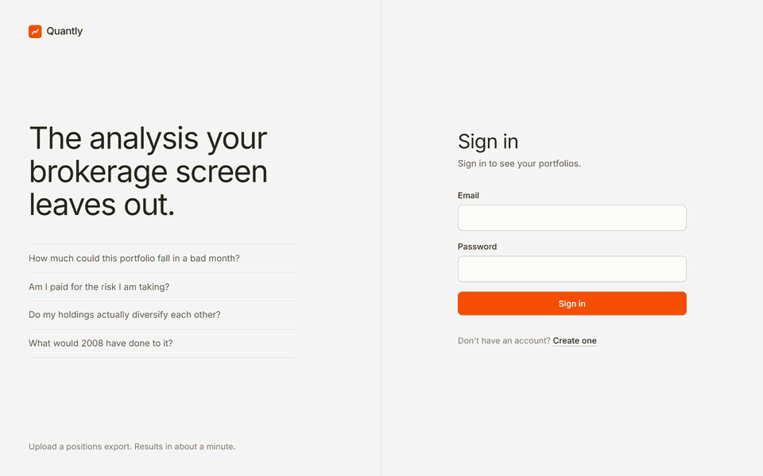
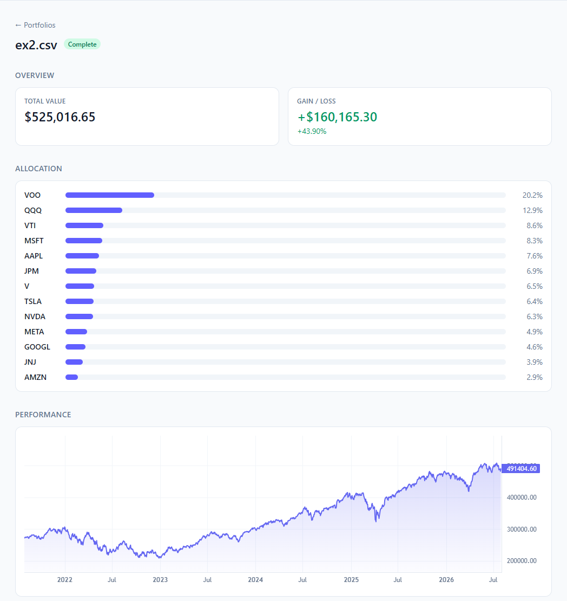
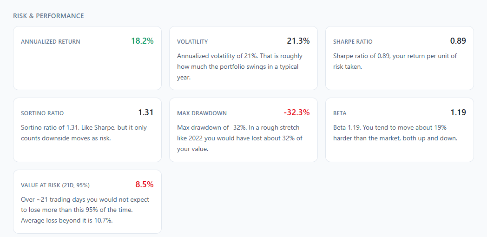
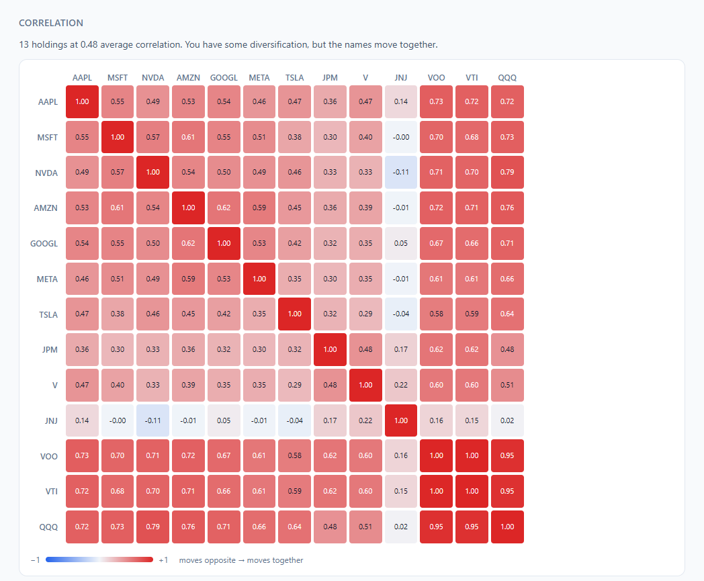
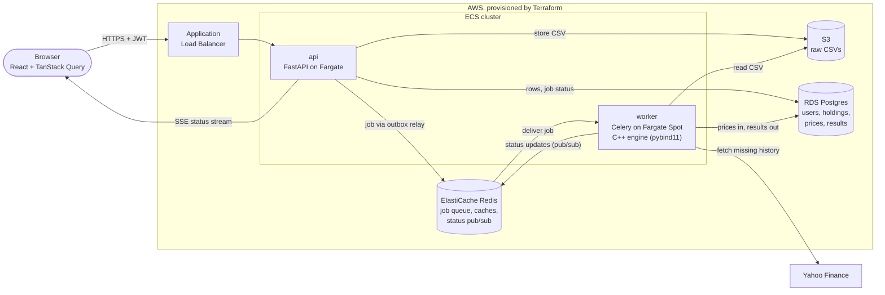

# Quantly

Portfolio analytics platform. Upload your holdings and get real risk and performance insights, not just "what's it worth."

## Overview

Quantly turns a CSV of your stock holdings into the analytics your brokerage screen doesn't give you: how risky your portfolio actually is, whether you're being paid for that risk, and whether you're genuinely diversified.

It is also a deliberate exercise in production system design. The API and the compute are separate services that scale independently, analysis runs asynchronously off a queue, the path-dependent risk math is written in C++ and benchmarked against NumPy, and the whole AWS stack is Terraform that gets stood up for a demo and torn down afterwards.

## Screenshots

Sign in, upload a brokerage export, and read the results:



The sample portfolio in [`example_csv/ex2.csv`](./example_csv/ex2.csv), analyzed against five years of real price history. ([Full page](./docs/screenshots/portfolio-detail.png).)



Every risk metric comes with what it means, not just the number:



The correlation heatmap answers "am I actually diversified?" at a glance:



## What it does

Beyond current value and gain/loss, Quantly surfaces risk and diversification insights. Each one is paired with a plain-English interpretation, not just a number:

| Metric | Question it answers |
|---|---|
| Volatility, max drawdown | How much could this realistically fall? |
| Sharpe / Sortino ratio | Am I being paid for the risk I'm taking? |
| Correlation matrix | Am I actually diversified, or do my holdings all move together? |
| Beta | How hard do I swing relative to the market? |
| Monte Carlo VaR | What does a bad month look like? |
| VaR method comparison + backtest | Do historical, normal, Cornish-Fisher and Monte Carlo VaR agree, and did the forecast hold up over the last two years? |
| Allocation, concentration | How exposed am I to a handful of names? |
| Historical stress tests | How would this exact portfolio have done in 2008, 2020 and 2022? Holdings without that history are estimated from beta. |
| Efficient frontier | Could a different mix of these holdings have earned more for the same risk? |
| Fama-French factor regression | Is my return just size, value or momentum exposure, or is there real alpha? |
| Risk contribution | Which holdings drive most of my risk, not just most of my money? |

It is a diagnostic tool. It does not recommend trades or execute them.

## Architecture



### Request lifecycle

1. The user signs in with email and password, or with Google. Either way the API issues its own short-lived access JWT plus a rotating refresh token, so nothing downstream ever sees a Google token.
2. They upload a CSV. The API validates it, stores the raw file in S3, writes the holdings, a job and an outbox row to Postgres in one transaction, and returns `202 Accepted` straight away. A Celery beat task relays the outbox row to Redis.
3. A Celery worker picks the job up, fetches whatever price history it is missing, computes the metrics, and writes the results back to Postgres.
4. The worker publishes each status change to a Redis channel for that portfolio. The frontend holds a Server-Sent Events stream open (`GET /portfolios/{id}/events`). The api sends the current status first, then relays those changes until the analysis completes or fails, and renders the charts and insight cards. If the stream can't be opened or drops early, it falls back to polling `/status`.

### Design decisions

- **Two services, not one.** The api is small, stateless and latency-sensitive. The worker is CPU-bound and bursty. They are deployed, sized and scaled independently (0.25 vCPU on Fargate against 1 vCPU on Fargate Spot), so a heavy analysis never slows a request down.
- **Uploads never block on compute.** The queue decouples upload latency from analysis time. A failed job marks its portfolio `failed` with a reason instead of leaving it stuck.
- **Factor data comes from Ken French's data library.** The daily Fama-French five factors and momentum are downloaded as CSV zips into a shared `factor_returns` table and refreshed at most weekly. A failed download keeps the stored data and retries within the hour.
- **The outbox closes the commit-then-enqueue gap.** The upload writes the portfolio, its job and an `outbox` row in one transaction. A beat task (every 2 seconds) publishes unpublished rows with `SELECT ... FOR UPDATE SKIP LOCKED` and marks them published. The api never talks to the broker, so a broker outage or a crash after commit cannot lose an accepted upload. Delivery is at-least-once, and the Celery task id is derived from the job id, so a re-sent row is the same task. The alternative, enqueueing after commit and relying on the outbox only as a fallback, saves up to two seconds but gives two publish paths to reason about. A sweeper re-announces any portfolio idle in `pending` or `processing` longer than 15 minutes.
- **Analysis is idempotent under redelivery.** Celery with `acks_late` can deliver a task twice. Each portfolio has a Redis lock (`SET NX PX`, random token, renewed by a heartbeat thread, released by a compare-and-delete Lua script). A second delivery while the lock is held returns `duplicate` and does nothing, and a delivery for a finished job returns `already_done`. The lock alone is not enough, since a paused worker can outlive its lock, so each run also writes a run token onto the job and its result write is a conditional update on that token. A stale run matches no row and writes nothing.
- **Failures are classified.** Transient errors (network, timeouts, Redis connection errors, database operational errors, yfinance rate limits) retry up to 4 attempts with exponential backoff and jitter, and the portfolio stays `processing` while the job shows `retrying` and its attempt count. Permanent errors (bad CSV, missing portfolio) and unrecognized errors fail immediately. A job that exhausts its retries is marked failed and its details are pushed to the Redis list `dlq:analysis`. `python -m scripts.dlq list` shows it and `python -m scripts.dlq requeue --all` sends it back through the outbox.
- **Rate limits use a sliding window.** Upload (per user) and login (per client IP) are limited by one Lua script over a sorted set of request times, so the check and the record are atomic across api replicas and the clock is Redis's. It is exact where a fixed window lets through double the limit at a boundary, and memory is bounded by the limit. Over the limit returns `429` with `Retry-After`. If Redis is down, login fails open so nobody is locked out, and upload fails closed (`503`) because it costs storage and a worker job. Limits are `QUANTLY_RATE_LIMIT_*` settings.
- **Market data is demand-driven and shared.** History is fetched lazily the first time a ticker appears, then only the gap since the last stored day. It lives once in a shared `prices` table, so storage grows with the number of distinct tickers held, not with the number of users. Latest prices sit in Redis with a 15 minute TTL.
- **Refresh tokens rotate and can be revoked.** They are opaque, stored hashed, and replaced on every use. Reusing an old one revokes the whole family.
- **Least privilege by default.** Each service has its own IAM roles (the api can only write to the bucket, the worker can only read from it), only the load balancer is reachable from the internet, and secrets are injected from SSM at task start.
- **Designed for scale, operated at n=1.** The stack costs about $75 a month if left running, so it isn't. See [infra/README.md](./infra/README.md).

## Benchmarks

Every C++ kernel has a pure-Python and a NumPy-vectorized baseline, timed across problem sizes by [`benchmarks/run_benchmarks.py`](./benchmarks/run_benchmarks.py). Full tables are in [`benchmarks/results.md`](./benchmarks/results.md). The headline rows:

| Kernel | Size | Pure Python | NumPy | C++ | C++ vs NumPy |
|---|--:|--:|--:|--:|--:|
| Max drawdown | 5,040 daily returns | 380.0 us | 239.6 us | 5.6 us | **42.9x faster** |
| Monte Carlo VaR | 100,000 paths, 21 days | 373.35 ms | 26.60 ms | 4.67 ms (22 threads), 27.36 ms (1 thread) | **5.7x faster** on 22 threads, 1.0x (a tie) on one |
| Correlation matrix | 100 assets x 1,260 days | 522.60 ms | 737.5 us | 929.8 us (22 threads), 1.29 ms (1 thread) | 0.8x (NumPy wins) |

The honest reading: C++ wins big on the path-dependent scan NumPy cannot vectorize. Monte Carlo VaR is a tie with NumPy on one thread, because NumPy's batched normal draws are as fast per variate as a hand-written loop; the C++ win is that paths are split into fixed blocks, each with its own counter-based Philox stream, so every core helps (about 7x on 22 threads for a million paths) and the answer is bit-identical whatever the thread count. A Sobol quasi-Monte Carlo variant reaches the same VaR error with roughly 10x fewer paths on the 21-day problem (convergence table in [`benchmarks/results.md`](./benchmarks/results.md)). Correlation still loses to multithreaded BLAS: the new tiled, threaded kernel with a runtime-dispatched AVX2 micro-kernel is 2x to 12x faster than the old naive loop and about 0.3x to 0.6x of NumPy on one thread, roughly even at 500 assets on all threads. Against pure Python the engine is 20x to 560x faster everywhere. That is why only the path-dependent metrics are routed to the engine, and why the worker falls back to NumPy without losing much when the engine isn't installed.

Numbers are from one machine: Intel Core Ultra 9 185H (22 logical CPUs, 22 engine threads), Windows 11, MinGW GCC, Python 3.14.0, NumPy 2.3.4. Timings are medians of repeated runs, and that machine is shared, so run-to-run drift of 10% or more is normal. The ratios are the point, not the absolute times. CI runs `benchmarks/run_benchmarks.py --quick --json` three times and fails if any single-thread C++/NumPy ratio drops more than 15% below [`benchmarks/baseline.json`](./benchmarks/baseline.json).

## Tech stack

| Layer | Tools |
|---|---|
| Frontend | React 19, TypeScript, Vite, Tailwind CSS, TanStack Query, Lightweight Charts |
| API | FastAPI, SQLAlchemy, Alembic, PyJWT, argon2 |
| Worker | Celery, Redis, pandas, NumPy, yfinance |
| Engine | C++17, pybind11, scikit-build-core, Catch2 |
| Data | PostgreSQL, Redis, S3 |
| Infrastructure | Terraform, AWS (ECS Fargate, RDS, ElastiCache, ALB, ECR, S3, SSM, CloudWatch) |
| CI/CD | GitHub Actions, OIDC to AWS |

## Repo layout

```
backend/
  api/          FastAPI app: routers, schemas, auth, dependencies
  worker/       Celery app, the analysis task, outbox relay and sweeper
  common/       shared by both: models, config, market data, analytics
  scripts/      demo seed, dead-letter tooling, chaos run
  tests/        pytest suite
engine/         C++ sources, pybind11 bindings, Catch2 tests
benchmarks/     C++ vs NumPy vs pure Python
frontend/       React app
infra/          Terraform, see infra/README.md
example_csv/    sample brokerage exports to upload
```

## Getting started

Everything runs locally for free. You need Docker, Python 3.13+ and a current Node LTS.

```bash
# postgres, redis, s3mock (a local stand-in for s3), the celery worker and beat
docker compose up -d

# api
cd backend
python -m venv .venv
# Windows (PowerShell):   .venv\Scripts\Activate.ps1
# macOS / Linux:          source .venv/bin/activate
pip install -r requirements/dev.txt
alembic upgrade head
uvicorn api.main:app --reload      # http://localhost:8000, docs at /docs
```

In a second terminal:

```bash
cd frontend
npm install
cp .env.example .env
npm run dev                        # http://localhost:5173
```

Then either register and upload one of the files in [`example_csv/`](./example_csv), or create a ready-made demo account with an analyzed portfolio:

```bash
cd backend
python -m scripts.seed             # prints the demo login when it is done
```

The worker container compiles the C++ engine into its image. Outside the container the engine is optional, and without it the same code uses the NumPy implementations. To build and install it into the current environment (needs a C++ compiler and CMake):

```bash
pip install ./engine
```

## Tests and CI

```bash
make lint     # ruff, isort, black
make test     # pytest
cd frontend && npm test   # vitest
cd backend && HYPOTHESIS_PROFILE=ci pytest tests/property   # property tests, see tests/property/README.md
```

| Workflow | Runs on | Does |
|---|---|---|
| `lint`, `test` | every push and PR | ruff, isort, black, pytest (including the Hypothesis property tests on a fixed seed). The job summary shows a coverage table and the XML is uploaded as an artifact |
| `engine` | every push and PR | builds the C++ engine, runs its Catch2 tests, then pytest with the engine installed so the Python/C++ parity tests run |
| `images` | PRs touching `backend/` | builds the api and worker images |
| `frontend` | every push and PR | oxlint, type-check and build, vitest |
| `sanitizers` | PRs and pushes touching `engine/` | builds the engine tests with AddressSanitizer and UBSan (`-DQUANTLY_SANITIZE=ON`) and runs them |
| `fuzz` | PRs touching the CSV parser or engine, weekly, on demand | Atheris on `parse_portfolio` (only `CSVValidationError` may escape) and a libFuzzer harness over the drawdown, correlation and VaR kernels. 60s per target on PRs, 10 minutes weekly. Crashing inputs are uploaded |
| `e2e` | pushes to `main`, PRs touching app code | Playwright against docker compose: register, upload `ex1.csv`, wait for the analysis, check the sections render. Prices are seeded, no Yahoo calls ([details](./e2e/README.md)) |
| `terraform plan` | PRs touching `infra/` | fmt, validate, and a plan posted as a PR comment |
| `deploy` | push to `main`, while enabled | pushes images to ECR, `terraform apply`, migrations, smoke test |

## Observability

Tracing and metrics are off by default and cost nothing when off. To turn them on locally:

```bash
# worker, collector, jaeger, prometheus and grafana
QUANTLY_OTEL_ENABLED=true docker compose --profile obs up -d

# api on the host, exporting to the collector
cd backend
QUANTLY_OTEL_ENABLED=true uvicorn api.main:app
```

| What | Where |
|---|---|
| Grafana dashboard (no login) | http://localhost:3000 |
| Traces (Jaeger) | http://localhost:16686 |
| Prometheus, rules and alerts | http://localhost:9090 |
| API metrics | http://localhost:8000/metrics |
| Worker metrics | http://localhost:9100 |

The dashboard shows request rate, p50/p95/p99 latency, 5xx ratio, job duration, a per-analyzer breakdown, queue depth, retries and failures, cache hit ratio and SLO burn rates. An upload shows up in Jaeger as one trace from the API request through the queue to the worker task and each analyzer. SLOs and the burn-rate alert rules are in [`docs/slo.md`](./docs/slo.md).

## Running a demo on AWS

The stack is built to be stood up for a demo and destroyed afterwards. Day-to-day work happens on `docker compose` for nothing.

### What it costs

| | Approx. |
|---|---|
| Left running for a month | ~$75 (ALB ~$16, RDS ~$14, ElastiCache ~$12, the two Fargate tasks ~$20, public IPv4 ~$15) |
| A two-hour demo, then destroyed | well under $1 |
| Torn down | $0 for the stack. The state bucket and budget alarm stay, and cost cents at most. |

There is deliberately no NAT gateway (about $32 a month per AZ). Tasks run in public subnets with a public IP for outbound access, and security groups keep inbound locked down. Prices are rough `us-east-1` on-demand figures, check the AWS pricing pages before relying on them.

### Runbook

Commands run from `infra/`. [infra/README.md](./infra/README.md) has the detail behind each step, and the manual equivalent of what CI does.

**Once per account**

1. Set the budget alarm (`budget/`). It emails if a teardown is forgotten. Do this before anything else.
2. Create the state bucket and the GitHub OIDC roles (`ci/`), then copy their three outputs into repo variables.

**Stand it up** (10 to 15 minutes, almost all of it RDS and ElastiCache)

3. Set the `DEPLOY_ENABLED` repo variable to `true` and run the `deploy` workflow from the Actions tab. It creates the stack, pushes both images, runs the migrations and smoke tests the api.

**Seed it and demo**

4. The database starts empty, so create the demo account and an analyzed portfolio:

   ```bash
   API_URL=$(terraform output -raw api_url)
   cd ../backend && python -m scripts.seed --api-url "$API_URL"
   ```

   It waits for the worker to finish and prints the login. Set `QUANTLY_DEMO_PASSWORD` first for anything other than the well-known default.
5. Point the local frontend at the stack and sign in:

   ```bash
   cd ../frontend && VITE_API_URL=$API_URL npm run dev
   ```

**Tear it down**

6. Set `DEPLOY_ENABLED` back to `false`, so the next push to `main` does not rebuild the stack.
7. Destroy it. This is the only real off switch: the ALB and ElastiCache cannot be stopped, only deleted, and a stopped RDS instance restarts itself after 7 days.

   ```bash
   terraform destroy -var-file=environments/dev.tfvars
   terraform state list   # prints nothing when it is all gone
   ```

## Status

The full path works end to end: auth, upload, async analysis, the insight layer, and the frontend. The infrastructure and deploy pipeline are written and validated, and are stood up on demand rather than left running.

Reliability work (outbox, locks, retries, rate limits) is covered by unit tests with fakeredis. To exercise it against real containers, bring up the compose stack, run migrations and the api, then run `python -m scripts.chaos --count 20 --kills 4` from `backend/`. It uploads portfolios, kills or restarts the worker at random while they process, and checks that every portfolio ends terminal with exactly one set of analytics rows. The same run is the manual and nightly `chaos` workflow. No results are published here yet.

Known gaps:

- The status stream uses Redis pub/sub, which is fire-and-forget. A message published while no stream is listening is lost, so each stream starts from the database status, and the client polls if a stream drops. Each open stream holds one API connection and one Redis connection until the analysis finishes (capped at 10 minutes).

## Motivation

Quantly is both a personal and technical project. The scale and richness of financial data allow for advanced analytics and meaningful performance insights that apply directly to my own portfolio. Building a tool that helps with real investing decisions makes it personally motivating and technically challenging. It's also a vehicle for going deep on production system design: async processing, infrastructure-as-code, benchmarked C++ performance work, and secure modern auth.
