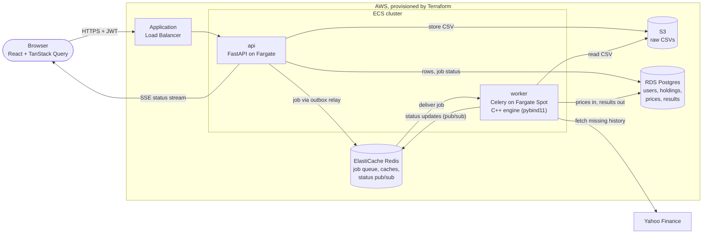

# Architecture

How Quantly is put together. For the reasoning behind each choice, the alternatives considered and what load testing found, see [design.md](./design.md).

## What it analyzes

Beyond current value and gain/loss, Quantly surfaces risk and diversification insights. Each one is paired with a plain-English interpretation, not just a number:

| Metric | Question it answers |
|---|---|
| Volatility, max drawdown | How much could this realistically fall? |
| Sharpe / Sortino ratio | Am I being paid for the risk I'm taking? |
| Correlation matrix | Am I actually diversified, or do my holdings all move together? |
| Beta | How hard do I swing relative to the market? |
| Monte Carlo VaR | What does a bad month look like? |
| VaR method comparison + backtest | Do historical, normal, Cornish-Fisher and Monte Carlo VaR agree, and did the forecast hold up over the last two years? |
| Allocation, concentration | How exposed am I to a handful of names? |
| Historical stress tests | How would this exact portfolio have done in 2008, 2020 and 2022? Holdings without that history are estimated from beta. |
| Efficient frontier | Could a different mix of these holdings have earned more for the same risk? |
| Fama-French factor regression | Is my return just size, value or momentum exposure, or is there real alpha? |
| Risk contribution | Which holdings drive most of my risk, not just most of my money? |

It is a diagnostic tool. It does not recommend trades or execute them.

## System



### Request lifecycle

1. The user signs in with email and password, or with Google. Either way the API issues its own short-lived access JWT plus a rotating refresh token, so nothing downstream ever sees a Google token.
2. They upload a CSV. The API validates it, stores the raw file in S3, writes the holdings, a job and an outbox row to Postgres in one transaction, and returns `202 Accepted` straight away. A Celery beat task relays the outbox row to Redis.
3. A Celery worker picks the job up, fetches whatever price history it is missing, computes the metrics, and writes the results back to Postgres.
4. The worker publishes each status change to a Redis channel for that portfolio. The frontend holds a Server-Sent Events stream open (`GET /portfolios/{id}/events`). The api sends the current status first, then relays those changes until the analysis completes or fails, and renders the charts and insight cards. If the stream can't be opened or drops early, it falls back to polling `/status`.

### Design decisions

- **Two services, not one.** The api is small, stateless and latency-sensitive. The worker is CPU-bound and bursty. They are deployed, sized and scaled independently (0.25 vCPU on Fargate against 1 vCPU on Fargate Spot), so a heavy analysis never slows a request down.
- **Uploads never block on compute.** The queue decouples upload latency from analysis time. A failed job marks its portfolio `failed` with a reason instead of leaving it stuck.
- **Factor data comes from Ken French's data library.** The daily Fama-French five factors and momentum are downloaded as CSV zips into a shared `factor_returns` table and refreshed at most weekly. A failed download keeps the stored data and retries within the hour.
- **The outbox closes the commit-then-enqueue gap.** The upload writes the portfolio, its job and an `outbox` row in one transaction. A beat task (every 2 seconds) publishes unpublished rows with `SELECT ... FOR UPDATE SKIP LOCKED` and marks them published. The api never talks to the broker, so a broker outage or a crash after commit cannot lose an accepted upload. Delivery is at-least-once, and the Celery task id is derived from the job id, so a re-sent row is the same task. The alternative, enqueueing after commit and relying on the outbox only as a fallback, saves up to two seconds but gives two publish paths to reason about. A sweeper re-announces any portfolio idle in `pending` or `processing` longer than 15 minutes.
- **Analysis is idempotent under redelivery.** Celery with `acks_late` can deliver a task twice. Each portfolio has a Redis lock (`SET NX PX`, random token, renewed by a heartbeat thread, released by a compare-and-delete Lua script). A second delivery while the lock is held returns `duplicate` and does nothing, and a delivery for a finished job returns `already_done`. The lock alone is not enough, since a paused worker can outlive its lock, so each run also writes a run token onto the job and its result write is a conditional update on that token. A stale run matches no row and writes nothing.
- **Failures are classified.** Transient errors (network, timeouts, Redis connection errors, database operational errors, yfinance rate limits) retry up to 4 attempts with exponential backoff and jitter, and the portfolio stays `processing` while the job shows `retrying` and its attempt count. Permanent errors (bad CSV, missing portfolio) and unrecognized errors fail immediately. A job that exhausts its retries is marked failed and its details are pushed to the Redis list `dlq:analysis`. `python -m scripts.dlq list` shows it and `python -m scripts.dlq requeue --all` sends it back through the outbox.
- **Rate limits use a sliding window.** Upload (per user) and login (per client IP) are limited by one Lua script over a sorted set of request times, so the check and the record are atomic across api replicas and the clock is Redis's. It is exact where a fixed window lets through double the limit at a boundary, and memory is bounded by the limit. Over the limit returns `429` with `Retry-After`. If Redis is down, login fails open so nobody is locked out, and upload fails closed (`503`) because it costs storage and a worker job. Limits are `QUANTLY_RATE_LIMIT_*` settings.
- **Market data is demand-driven and shared.** History is fetched lazily the first time a ticker appears, then only the gap since the last stored day. It lives once in a shared `prices` table, so storage grows with the number of distinct tickers held, not with the number of users. Latest prices sit in Redis with a 15 minute TTL.
- **Refresh tokens rotate and can be revoked.** They are opaque, stored hashed, and replaced on every use. Reusing an old one revokes the whole family.
- **Least privilege by default.** Each service has its own IAM roles (the api can only write to the bucket, the worker can only read from it), only the load balancer is reachable from the internet, and secrets are injected from SSM at task start.
- **Designed for scale, operated at n=1.** The stack costs about $75 a month if left running, so it isn't. See [infra/README.md](../infra/README.md).

## Tech stack

| Layer | Tools |
|---|---|
| Frontend | React 19, TypeScript, Vite, Tailwind CSS, TanStack Query, Lightweight Charts |
| API | FastAPI, SQLAlchemy, Alembic, PyJWT, argon2 |
| Worker | Celery, Redis, pandas, NumPy, yfinance |
| Engine | C++17, pybind11, scikit-build-core, Catch2 |
| Data | PostgreSQL, Redis, S3 |
| Infrastructure | Terraform, AWS (ECS Fargate, RDS, ElastiCache, ALB, ECR, S3, SSM, CloudWatch) |
| CI/CD | GitHub Actions, OIDC to AWS |

## Repo layout

```
backend/
  api/          FastAPI app: routers, schemas, auth, dependencies
  worker/       Celery app, the analysis task, outbox relay and sweeper
  common/       shared by both: models, config, market data, analytics
  scripts/      demo seed, dead-letter tooling, chaos run
  tests/        pytest suite
engine/         C++ sources, pybind11 bindings, Catch2 tests
benchmarks/     C++ vs NumPy vs pure Python
frontend/       React app
infra/          Terraform, see infra/README.md
loadtest/       k6 scenarios, pinned compose override, capacity model
example_csv/    sample brokerage exports to upload
```

## Status

The full path works end to end: auth, upload, async analysis, the insight layer, and the frontend. The Terraform passes `fmt` and `validate`, and the stack is stood up on demand rather than left running. The autoscaling and observability additions have not been applied to AWS yet.

Reliability work (outbox, locks, retries, rate limits) is covered by unit tests with fakeredis and by a chaos run against real containers: `python -m scripts.chaos --count 60 --kills 6` from `backend/` uploads unique portfolios, kills or restarts the worker at random while they process, and checks that every portfolio ends terminal with exactly one set of analytics rows. It is also the manual and nightly `chaos` workflow.

Known gaps:

- The status stream uses Redis pub/sub, which is fire-and-forget. A message published while no stream is listening is lost, so each stream starts from the database status, and the client polls if a stream drops. Each open stream holds one API connection and one Redis connection until the analysis finishes (capped at 10 minutes).
